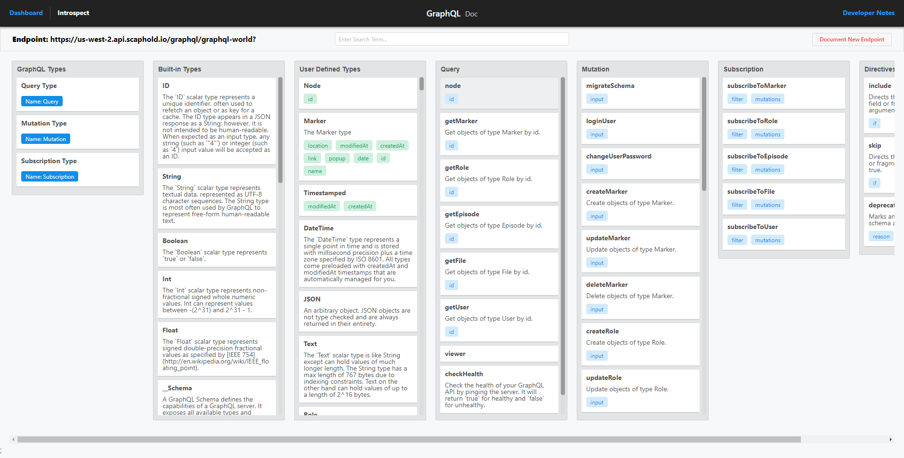

# GraphQL Doc
Generate Documentation for GraphQL Endpoints Instantly.




This application was inspired by **GraphiQL**, It categorizes all the Types, Queries, Mutations, Subscriptions in the way we code it, Making it easier for us to use and debug GraphQL Server Schemas.

We can easily filter through entire schema to find a single type/query/mutation/subscription we're looking for., I hope this will be beneficial to some as this has been beneficial to me.


## Installation

Just clone this repo and then run

```javascript
$ yarn install // or npm install
```

to install all the dependencies.

### After installing the dependencies

1. Run `yarn build` to make a production build of the application.
2. Now you can host the `build` directory wherever you want, I have used `firebase` but you can easily use **AWS**, **Netlify**, **Github Pages**, etc


